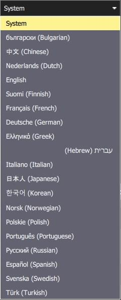
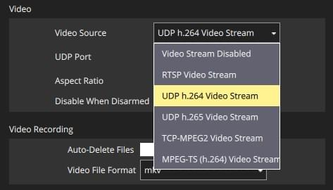
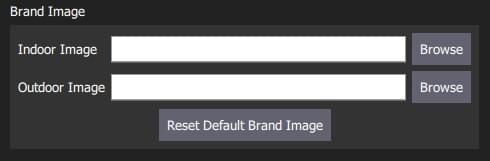

# 常规设置(设置视图)

一般设置 (**SettingsView > General Settings**) 是应用程序级别配置的主要位置。
设置值包括：显示单位、自动连接装置、视频显示和存储、RTK GPS、品牌图像和其他杂项设置。

:::info
即使没有工具连接，值也是可以设置的。 需要重新启动车辆的设置会在用户界面中显示。
:::

## 单位

本节定义应用程序中使用的显示单位。

设置如下：

- **距离** 米|英尺。
- \*\* 面积\*\*：平方米 | 平方英尺 | 平方公里 | 公顷 | 英亩 | 平方英里
- **速度**：米/秒 | 英尺/秒 | 英里/小时 | 公里/小时 | 节
- **温度** ：摄氏度 | 华氏度

## 杂项

本节定义了一些杂项设置，涉及（不完全）：字体大小、配色方案、地图提供者、地图类型、遥测记录、音频输出、低电量公告级别、默认任务高度、[虚拟操纵杆]（.../settings_view/virtual_joystick.md）、任务自动加载、默认应用程序文件加载/保存路径等。

设置如下：

- **语言**：系统 (系统语言) | 保加利亚语，中文...

  

  翻译通常纳入应用程序，并根据系统语言自动选择。

  从载具下载的元数据(例如参数描述)也可能有翻译。
  这些都是通过载具连接从互联网下载的。 然后本地缓存翻译。
  这意味着在载具连接期间至少需要一次互联网连接。

- **颜色方案**: 室内(暗) | 户外(亮度)

- **地图提供商**: Google | Mapbox | Bing | Airmap | VWorld | Eniro| Statkart

- **地图类型**: Road | Mixed | Satellite

- **流式传输地面控制站位置**永远不要| 始终关注我的飞行模式。

- **UI 缩放** ：UI 缩放百分比 (影响字体，图标，按钮大小，布局等)

- **静音所有音频输出**：关闭所有音频输出。

- **检查互联网连接**：取消选中以允许地图在中国/地图上下载可能失败的地方使用(停止地图引擎持续检查互联网连接)。

-  **Autoload Mission**：如果启用，连接时自动上传计划到车辆。
  - 计划文件必须命名为 **AutoLoad#.plan**, 其中`#` 被替换为载具ID。
  - 计划文件必须位于[应用程序加载/保存路径](#load_save_path)。

- **在下次启动时清除所有设置**：重置所有设置为默认设置(包括此设置)，当 _QGroundControl_ 重启时。

- **电池电量过低通知**：_QGroundControl_ 将在电池电量水平上启动低电量通知。

- **应用程序加载/保存路径**: 下载/保存应用程序文件的默认位置，包括参数、遥测日志和飞行计划。

## 数据持久化 {#data_persistence}

设置如下：

- **禁用所有数据持久化**：选中以防止任何数据被保存或缓存：日志、地图栏等。
  此设置禁用[遥测日志部分](#telemetry_logs)。

## 来自载具的 {#telemetry_logs} 遥测日志

设置如下：

- **每次飞行后保存日志**: 遥测日志 (`.tlog`) 飞行后自动保存到 _Application Load/Save Path_ ([above](#load_save_path) )。
- **保存日志，即使载具没有装备设备**: 当载具连接到 _QGroundControl_ 时记录日志。
  当最后一辆载具断开时停止日志记录。
- [**CSV 日志**](csv.md)：将遥测数据子集记录到一个CSV文件。

## Fly View {#fly_view}

The settings are:

- **Use Preflight Checklist**: Enable pre-flight checklist in Fly toolbar.

- **Enforce Preflight Checklist**: Checklist completion is a pre-condition for arming.

- **Keep Map Centered on Vehicle**: Forces map to center on the currently selected vehicle.

- **Show Telemetry Log Replay Status Bar**: Display status bar for [Replaying Flight Data](../fly_view/replay_flight_data.md).

- **Virtual Joystick**: Enable [virtual joysticks](../settings_view/virtual_joystick.md) (PX4 only)

- **Use Vertical Instrument Panel**: Align instrument panel vertically rather than horizontally (default).

- **Show additional heading indicators on Compass**: Adds additional indicators to the compass rose:

- _Blue arrow_: course over ground.

- _White house_: direction back to home.

- _Green line_: Direction to next waypoint.

- **Lock Compass Nose-Up**: Check to rotate the compass rose (default is to rotate the vehicle inside the compass indicateor).

- **Guided Minimum Altitude**: Minimum value for guided actions altitude slider.

- **Guided Maximum Altitude**: Minimum value for guided actions altitude slider.

- **Go To Location Max Distance**: The maximum distance that a Go To location can be set from the current vehicle location (in guided mode).

## Plan View {#plan_view}

The settings are:

- **Default Mission Altitude**: The default altitude used for the Mission Start Panel, and hence for the first waypoint.

## AutoConnect to the following devices {#auto_connect}

This section defines the set of devices to which _QGroundControl_ will auto-connect.

Settings include:

- **Pixhawk:** Autoconnect to Pixhawk-series device
- **SiK Radio:** Autoconnect to SiK (Telemetry) radio
- **PX4 Flow:** Autoconnect to PX4Flow device
- **LibrePilot:** Autoconnect to Libre Pilot autopilot
- **UDP:** Autoconnect to UDP
- **RTK GPS:** Autoconnect to RTK GPS device
- **NMEA GPS Device:** Autoconnect to an external GPS device to get ground station position ([see below](#nmea_gps))

### Ground Station Location (NMEA GPS Device) {#nmea_gps}

_QGroundControl_ will automatically use an internal GPS to display its own location on the map with a purple `Q` icon (if the GPS provides a heading, this will be also indicated by the icon).
It may also use the GPS as a location source for _Follow Me Mode_ - currently supported on [PX4 Multicopters only](https://docs.px4.io/en/flight_modes/follow_me.html).

You can also configure QGC to connect to an external GPS device via a serial or UDP port.
The GPS device must support the ASCII NMEA format - this is normally the case.

:::tip
A higher quality external GPS system may be useful even if the ground station has internal GPS support.
:::

Use the _NMEA GPS Device_ drop-down selector to manually select the GPS device and other options:

- USB connection:

  

  - **NMEA GPS Device:** _Serial_
  - **NMEA GPS Baudrate**: The baudrate for the serial port

  ::: tip
  To troubleshoot serial GPS problems: Disable RTK GPS [auto connection](#auto_connect), close _QGroundControl_, reconnect your GPS, and open QGC.
  :::

- Network connection:

  

  - **NMEA GPS Device:** _UDP Port_.
  - **NMEA Stream UDP Port**: The UDP port on which QGC will listen for NMEA data (QGC binds the port as a server)

## RTK GPS {#rtk_gps}

This section allows you to specify the RTK GPS "Survey-in" settings, to save and reuse the result of a Survey-In operation, or to directly enter any other known position for the base station.

:::info
The _Survey-In_ process is a startup procedure required by RTK GPS systems to get an accurate estimate of the base station position.
The process takes measurements over time, leading to increasing position accuracy.
Both of the setting conditions must met for the Survey-in process to complete.
For more information see [RTK GPS](https://docs.px4.io/en/advanced_features/rtk-gps.html) (PX4 docs) and [GPS- How it works](http://ardupilot.org/copter/docs/common-gps-how-it-works.html#rtk-corrections) (ArduPilot docs).
:::

:::tip
In order to save and reuse a base position (because Survey-In is time consuming!) perform Survey-In once, select _Use Specified Base Position_ and press **Save Current Base Position** to copy in the values for the last survey.
The values will then persist across QGC reboots until they are changed.
:::

The settings are:

- Perform Survey-In
  - **Survey-in accuracy (U-blox only):** The minimum position accuracy for the RTK Survey-In process to complete.
  - **Minimum observation duration:** The minimum time that will be taken for the RTK Survey-in process.
- Use Specified Base Position
  - **Base Position Latitude:** Latitude of fixed RTK base station.
  - **Base Position Longitude:** Longitude of fixed RTK base station.
  - **Base Position Alt (WGS94):** Altitude of fixed RTK base station.
  - **Base Position Accuracy:** Accuracy of base station position information.
  - **Save Current Base Position** (button): Press to copy settings from the last Survey-In operation to the _Use Specified Base Position_ fields above.

## ADSB Server {#adsb_server}

The settings are:

- **Connect to ADSB SBS server**: Check to connect to ADSB server on startup.
- **Host address**: Host address of ADSB server
- **Server port**: Port of ADSB server

QGC can consume ADSB messages in SBS format from a remote or local server (at the specified IP address/port) and display detected vehicles on the Fly View map.

::: tip
One way to get ADSB information from nearby vehicles is to use [dump1090](https://github.com/antirez/dump1090) to serve the data from a connected RTL-SDR dongle to QGC.

The steps are: 1.

1. Get an RTL-SDR dongle (and antenna) and attach it to your ground station computer (you may need to find compatible drivers for your OS).
2. Install _dump1090_ on your OS (either pre-built or build from source).
3. Run `dump1090 --net` to start broadcasting messages for detected vehicles on TCP localhost port 30003 (127.0.0.1:30003).
4. Enter the server (`127.0.0.1`) and port (`30003`) address in the QGC settings above.
5. Restart QGC to start seeing local vehicles on the map.

:::

## Video {#video}

The _Video_ section is used to define the source and connection settings for video that will be displayed in _Fly View_.

The settings are:

- **视频源** ：视频流已禁用 | RTSP 视频流| UDP h.264 视频流| UDP h. 65 视频流 | TCP-MPEG2 视频流 | MPEGTS 视频流 | 集成摄像头

  ::: info
  If no video source is specified then no other video or _video recording_ settings will be displayed (above we see the settings when UDP source is selected).
  :::

- **URL/Port**: Connection type-specific stream address (may be port or URL).

- **Aspect Ratio**: Aspect ratio for scaling video in video widget (set to 0.0 to ignore scaling)

- **Disabled When Disarmed**: Disable video feed when vehicle is disarmed.

- **Low Latency Mode**: Enabling low latency mode reduces the video stream latency, but may cause frame loss and choppy video (especially with a poor network connection). <!-- disables the internal jitter buffer -->

## Video Recording

The _Video Recording_ section is used to specify the file format and maximum allocated file storage for storing video.
Videos are saved to a sub-directory ("Video") of the [Application Load/Save Path](#load_save_path).

The settings are:

- **Auto-Delete Files**: If checked, files are auto deleted when the specified amount of storage is used.
- **Max Storage Usage**: Maximum video file storage before video files are auto deleted.
- **Video File Format**: File format for the saved video recording: mkv, mov, mp4.

## Brand Image

This setting specifies the _brand image_ used for indoor/outdoor colour schemes.

The brand image is displayed in place of the icon for the connected autopilot in the top right corner of the toolbar.
It is provided so that users can easily create screen/video captures that include a company logo/branding.

The settings are:

- **Indoor Image**: Brand image used in [indoor color scheme](#colour_scheme)
- **Outdoor Image**: Brand image used in [outdoor color scheme](#colour_scheme)
- **Reset Default Brand Image**: Reset the brand image back to default.
