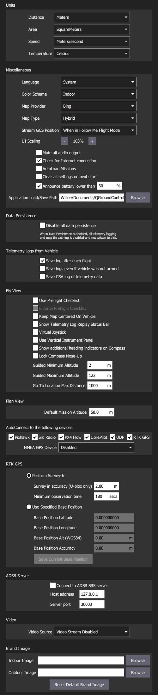
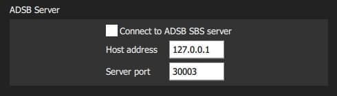

# 常规设置(设置视图)

常规设置 (**设置视图 > 常规视图**) 是应用程序级别配置的主要位置。
设置值包括：显示单位、自动连接装置、视频显示和存储、RTK GPS、品牌图像和其他杂项设置。

:::info
即使没有工具连接，值也是可以设置的。 需要重新启动载具的设置会在用户界面中显示。
:::

## 单位

本节定义应用程序中使用的显示单位。

设置如下：

- **距离** 米|英尺。
- \*\* 面积\*\*：平方米 | 平方英尺 | 平方公里 | 公顷 | 英亩 | 平方英里
- **速度**：米/秒 | 英尺/秒 | 英里/小时 | 公里/小时 | 节
- **温度** ：摄氏度 | 华氏度

## 杂项

本节定义了一些杂项设置，涉及（不完全）：字体大小、配色方案、地图提供者、地图类型、遥测记录、音频输出、低电量公告级别、默认任务高度、[虚拟操纵杆]（.../settings_view/virtual_joystick.md）、任务自动加载、默认应用程序文件加载/保存路径等。

设置如下：

- **语言**：系统 (系统语言) | 保加利亚语，中文...

  

  翻译通常纳入应用程序，并根据系统语言自动选择。

  从载具下载的元数据(例如参数描述)也可能有翻译。
  这些都是通过载具连接从互联网下载的。 然后本地缓存翻译。
  这意味着在载具连接期间至少需要一次互联网连接。

- **颜色方案**: 室内(暗) | 户外(亮度)

- **地图提供商**: Google | Mapbox | Bing | Airmap | VWorld | Eniro| Statkart

- **地图类型**: Road | Mixed | Satellite

- **流式传输地面控制站位置**永远不要| 始终关注我的飞行模式。

- **UI 缩放** ：UI 缩放百分比 (影响字体，图标，按钮大小，布局等)

- **静音所有音频输出**：关闭所有音频输出。

- **检查互联网连接**：取消选中以允许地图在中国/地图上下载可能失败的地方使用(停止地图引擎持续检查互联网连接)。

-  **自动加载任务**：如果启用，连接时自动上传计划到载具。
  - 计划文件必须命名为 **AutoLoad#.plan**, 其中`#` 被替换为载具ID。
  - 计划文件必须位于[应用程序加载/保存路径](#load_save_path)。

- **在下次启动时清除所有设置**：重置所有设置为默认设置(包括此设置)，当 _QGroundControl_ 重启时。

- **电池电量过低通知**：_QGroundControl_ 将在电池电量水平上启动低电量通知。

- **应用程序加载/保存路径**: 下载/保存应用程序文件的默认位置，包括参数、遥测日志和飞行计划。

## 数据持久化 {#data_persistence}

设置如下：

- **禁用所有数据持久化**：选中以防止任何数据被保存或缓存：日志、地图栏等。
  此设置禁用[遥测日志部分](#telemetry_logs)。

## 来自载具的 {#telemetry_logs} 遥测日志

设置如下：

- **每次飞行后保存日志**: 遥测日志 (`.tlog`) 飞行后自动保存到 _Application Load/Save Path_ ([above](#load_save_path) )。
- **保存日志，即使载具没有解锁设备**: 当载具连接到 _QGroundControl_ 时记录日志。
  当最后一辆载具断开时停止日志记录。
- [**CSV 日志**](csv.md)：将遥测数据子集记录到一个CSV文件。

## 飞行视图{#fly_view}

设置如下：

- **使用飞行检查清单**：在飞行工具栏中启用飞行前检查清单。

- **强制执行飞行检查清单**：完成检查清单是解锁的先决条件。

- **保持地图以载具为中心**：强制地图以当前选定的载具为中心。

- **显示遥测日志重播状态栏**：显示[重播飞行数据](../fly_view/replay_flight_data.md)的状态栏。

- **虚拟操纵杆**：启用 [虚拟操纵杆](../settings_view/virtual_joystick.md) (仅限PX4)

- **使用垂直仪表面**：垂直对齐仪表面，而不是水平对齐(默认)。

- **在指南针上显示额外的标题指示器**：在指南针旋转中添加额外的指示器：

- _蓝色箭头_：地速航向。

- **锁定罗盘指北**：勾选以旋。转罗盘刻度盘（默认是在罗盘指示器内旋转飞行器）。

- _绿色的线_：指向下一个航点。

- **锁定罗盘指北**：勾选以旋转罗盘刻度盘（默认是在罗盘指示器内旋转飞行器）。

- **引导最小高度**：引导操作高度滑块的最小值。

- **引导最大高度**：引导操作高度滑块的最大值。

- 计划视图 {#plan_view}

## 计划视图 {#plan_view}

设置如下：

- **默认飞行任务高度**：用于任务起始面板的默认高度，因此也是第一个航点的默认高度。

## 自动连接到以下设备 {#auto_connect}

本节定义了_QGroundControl_ 将自动连接到的设备集合。

设置包括：

- **Pixhawk:** 自动连接到 Pixhawk系列设备
- **SiK电台**：自动连接到SiK（遥测）电台
- **PX4 Flow：** 自动连接到 PX4Flow 设备
- **LibrePilot:** 自动连接到 Libre Pilot autopilot
- **UDP:** 自动连接到 UDP
- **RTK GPS：** 自动连接到 RTK GPS 设备
- **NMEA GPS Device:** Autoconnect to an external GPS device to get ground station position ([see below](#nmea_gps))

### 地面站位置(NMEA GPS 设备) {#nmea_gps}

_QGroundControl_ 将自动使用内置GPS，通过紫色的 “Q” 图标在地图上显示自身位置（如果GPS提供航向，图标也会指示出来）。
它也可能将GPS用作 _跟随我模式_ 的位置源 - 目前仅在[PX4多旋翼飞行器上支持](https://docs.px4.io/en/flight_modes/follow_me.html) 。

您也可以通过串口或 UDP端口配置QGC 连接到外部GPS设备。
GPS设备必须支持 ASCII NMEA 格式――通常情况是这样。

:::tip
即使地面站得到内部全球定位系统支持，质量更高的外部全球定位系统也可能有用。
:::

使用 _NMEA GPS 设备_下拉选择器手动选择GPS 设备和其他选项：

- USB 连接：

  

  - **NMEA GPS设备**：_串口_
  - **NMEA GPS波特率**：串口的波特率

  :::tip
  解决串行GPS问题: 禁用 RTK GPS [自动连接](#auto_connect), 关闭 _QGroundControl_, 重新连接您的 GPS, 并打开 QGC。
  :::

- 网络连接：

  

  - **NMEA GPS 设备:** _UDP 端口_。
  - **NMEA 流 UDP 端口**: QGC 监听NMEA 数据的 UDP 端口(QGC 绑定端口作为服务器)

## RTK GPS {#rtk_gps}

此部分允许您指定RTK GPS “测量初始化” 设置，保存并复用测量初始化操作的结果，或者直接输入基站的任何其他已知位置。

:::info
_Survey-In_进程是 RTK GPS 系统为准确估算基站位置所需的启动程序。
这一过程经过一段时间后进行测量，从而提高了位置准确性。
这两个设置条件都必须满足，以便完成调查进程。
欲了解更多信息，请参阅[RTK GPS](https://docs.px4.io/en/advanced_features/rtk-gps.html) (PX4 文档) 和 [GPS- 它如何工作](http://ardupilot.org/copter/docs/common-gps-how-it-works.html#rtk-corrections) (ArduPilot 文档)。
:::

:::tip
为了保存和重新使用基本位置(因为检查耗费时间！) 执行一次测量初始化，选择 _使用指定的基站位置_ ，然后按下 _保存当前基站位置_ ，将上次测量的值复制进去。
然后，值将在所有QGC 重启后持续，直到它们被更改。
:::

步骤如下：

- 执行 Survey-In
  - **调查精度(仅有U-blox)：** RTK调查完成的最低位置精度。
  - **最小观察持续时间：** RTK调查过程的最短时间。
- 使用指定的基站位置
  - **基础位置纬度：** 固定RTK基站纬度。
  - **基础位置经度：** 固定RTK基地站的经度。
  - **Base Position Alt (WGS84):** Altitude of fixed RTK base station.
  - **基础位置精确度：** 基础站位置信息的准确性。
  - **保存当前基地位置** (按钮)：点击复制上次调查操作中的设置到上面的 _Use 指定的基础位置_ 字段。

## ADSB 服务器 {#adsb_server}

设置如下：

- **连接到 ADSB SBS 服务器**：检查启动时连接到 ADSB 服务器。
- **主机地址**: ADSB 服务器的主机地址
- **服务器端口**：ADSB服务器端口

QGC 可以使用 SBS 格式从远程服务器或本地服务器(在指定的 IP 地址/端口)消耗ADSB 消息，并在飞行视图的地图上显示检测到的车辆。

::: tip
One way to get ADSB information from nearby vehicles is to use [dump1090](https://github.com/antirez/dump1090) to serve the data from a connected RTL-SDR dongle to QGC.

步骤如下：

1. 获取RTL-SDR dongle (和天线)，并将其附加到您的地面站计算机(您可能需要为您的操作系统找到兼容的驱动程序)。
2. 在您的操作系统上安装 _dump1090_ (要么预建要么从源代码构建)。
3. 运行 `dump1090 --net` 以开始在TCP本地主机端口30003（127.0.0.1:30003）上广播检测到的飞行器的消息。
4. 在上述QGC 设置中输入服务器 (`127.0.0.1`)和端口 (`30003`) 地址。
5. 重新启动QGC 以开始查看地图上的本地车辆。

:::

## 视频 {#video}

_视频_ 部分用于定义视频的源和连接设置，将显示在 _飞行视图_中。

设置如下：

- **视频源** ：视频流已禁用 | RTSP 视频流| UDP h.264 视频流| UDP h. 65 视频流 | TCP-MPEG2 视频流 | MPEGTS 视频流 | 集成摄像头

  ::: info
  如果没有指定视频源，那么将不会显示其他视频或 _video 录制设置(我们在选择UDP源时看到设置)。
  :::

- **URL/端口**：连接类型特定流地址 (可能是端口或URL)。

- **宽高比**：视频小部件中缩放视频的宽高比(设置为0.0 忽略缩放)

- **锁定时禁用**：飞行器锁定时禁用视频传输。

- **低延迟模式**：启用低延迟模式可降低视频流延迟，但可能会导致丢帧和视频卡顿（特别是在网络连接不佳的情况下）。 <!-- disables the internal jitter buffer -->

## 视频录制

使用 _视频录制_ 部分指定文件格式和最大分配的文件存储以存储视频。
视频被保存到 [应用程序加载/保存路径]的子目录 ("视频") (#load_save_path)。

设置为：

- **自动删除文件**：如果选中，当使用指定的存储量时，文件将被自动删除。
- **最大存储使用率**：视频文件自动删除前最大视频存储。
- **视频文件格式**：保存的视频录制文件格式：mkv、mov、mp4。

## 品牌图像

此设置指定用于室内/户外色彩方案的 _品牌图像_。

品牌图像将以图标取代工具栏右上角的连接自动化图标。
提供它是为了用户能够轻松创建屏幕/视频捕获，包括公司标志/品牌。

设置如下：

- **内部图像**：[内部颜色方案]中使用的品牌图像(#colour_scheme)
- **外部图像**：[外部色彩方案]中使用的品牌图像(#colour_scheme)
- **重置默认品牌图像**：将品牌图像重置为默认值。
