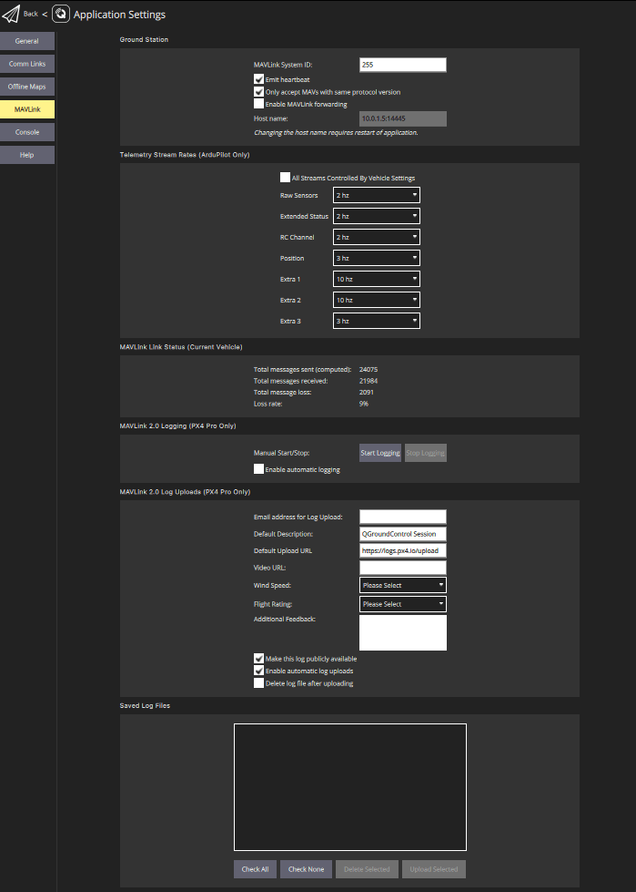
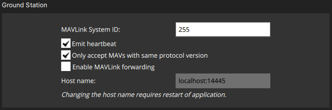

# MAVLink 设置

MAVLink 设置 (**设置视图 > MAVLink**) 允许您配置选项和查看针对MAVLink通信的信息。
这包括设置 _QGroundControl_ 的 MAVLink 系统ID，并查看链接质量。

该屏幕还允许您管理[MAVLink 2日志流传输](#logging)（仅适用于PX4），包括_自动将日志上传至飞行评估_！

## 地面站 {#ground_station}

本节设置 _QGroundControl_的 MAVLink 属性和行为。

- **MAVLink 系统ID：** MAVLink 网络上的 _QGroundControl_ 系统 ID (默认：255)。
  载具通常从1处配给标识符。
  如果网络上有多个地面站或MAVLink应用，您可能需要指定另一个ID。
- **发送心跳**：禁用定期发送MAVLink心跳消息（默认值：True）。
  一般来说，你不应该关闭这个功能。
- **只接受具有相同协议版本的 MAVs：** 设置为 true 仅连接到 MAVLink 1 或 MAVLink 2 载具(默认：True)。
- **启用 MAVLink 转发:** 启用 _QGroundControl_ 来将 MAVLink 消息从已连接的车辆转发到另一个 UDP端点(默认: False)。
  请注意，此转发是单向的：从QGC到指定的主机。
  从指定主机收到的任何MAVLink消息将被忽略。

## 链接状态 {#link_status}

这显示了通过通信链接传输MAVLink消息的状态。
高**丢失率** 可能会导致对参数下载或任务上传/下载等事项的协议错误。

## MAVLink 2 日志(仅PX4) {#logging}

_MAVLink 2 日志_ 设置 (PX4) 配置从 PX4 到 _QGroundControl_ 的实时日志流量，并将日志上传到 [飞行评论](https://logs.px4.io)。

:::warning
MAVLink 2 日志不能用于"基本"设置，因为它需要一个与载具的常用高率的 MAVLink 连接(它可以在 WiFI 上工作，但将在 Telemetry 链接上工作)。
:::

:::tip
在理论上，流媒体允许实时分析数据。
在编写实时分析报告时，尚未实施。
:::

日志格式与 SD 卡日志相同(使用 [分析视图 > 日志下载](../analyze_view/log_download.md) 下载)。 但实际记录的数据可能略有不同，因为日志开始/停止时间是由 _QGroundControl_ 控制的，并且因为在光滑通道流媒体时可能出现一些退出。

_MAVLink 2 日志_ 部分允许您手动启动和停止日志记录并启用自动捕获日志。

“MAVLink 2日志上传”部分允许您配置将MAVLink日志上传到[飞行评估](https://logs.px4.io)。
您可以指定否则您必须直接输入站点的所有字段。 并选择日志是自动还是手动上传。

字段为：

- **日志上传的电子邮件地址：** _飞行评估_ 将给您发送一个链接到此地址上传。
  这很重要，因为否则您将无法在上传后访问非公开的日志。
- **默认描述：** 用于日志的飞行描述/名称。
- **默认上传URL：** 上传日志/日志元数据的 URL。
  默认设置为 _飞行评估_ URL。
- **视频 URL:** (可选) URL，用于与日志相关的飞行视频。
  为了便于分析，可将此内容列入飞行审查页。
- **风速：** 用于帮助调试和过滤(多次飞行)。 允许的值: _Calm_ | _Breeze_ | _Gale_ | _Storm_。
- **飞行评级：** 用于帮助调试和过滤（多次飞行）。 允许的值:_Crashed (Pilot Error)_ | _Crashed (Software or Hardware Issue)_ | _Unsatisfactory_ | _Good_ | _Great_。
- **附加反馈：** (可选)。 输入更详细的飞行或行为描述。
- **公开显示此日志：** 如果设置，日志将在_飞行评估_上可见并可搜索。
  如果没有设置，它将只能通过上传上传的电子邮件链接获得。
- **启用自动上传日志：** 如果设置，日志将自动上传完成。
- **上传后删除日志文件：** 如果设置，上传后日志将自动删除。

_保存的日志文件_部分用于手动管理日志上传。
使用复选框和按钮选择日志，并删除或上传日志。

:::tip
您可以更改上面_MAVLink 2 日志上传的参数，以指定上传日志的单独描述。
:::

