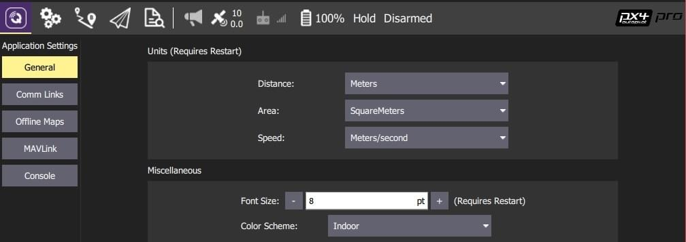

# 设置视图

_设置视图_ 用于配置 _QGroundControl_ 应用程序 (而不是特定的载具) 的设置。 您无需连接载具就能更改这些值。

您可以通过点击左侧边栏中的按钮来切换各种设置选项。

## 设置选项

**[常规](general.md)**  主要应用程序配置设置。 用于指定：显示单位、自动连接装置、视频显示和存储、RTK GPS等。

**Comm Links**  允许您手动创建通信链接并连接到它们。 _请注意，通常无需这样做，因为QGroundControl会自动连接到最常见的设备。_

**[离线地图](offline_maps.md)**  允许您在没有互联网连接时使用缓存地图。

**[MAVLink](mavlink.md)**  与 MAVLink 连接到车辆相关联的设置。

**[Console](console_logging.md)**  用于捕捉应用程序日志以帮助诊断应用程序问题。
