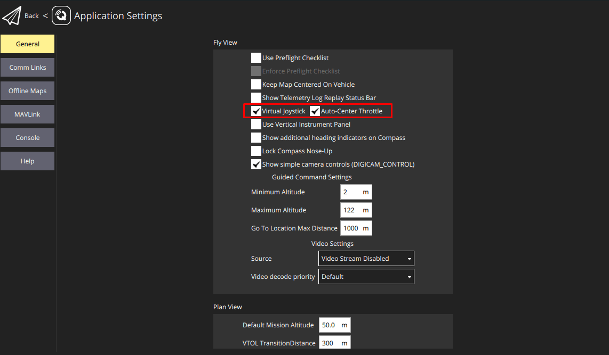

# 虚拟摇杆

_QGroundControl_ 允许您控制带有屏幕虚拟缩略图的载具。 这些显示在下面的飞行视图中。

:::info
拇指摇杆控制不如使用遥控发射器那样灵敏（因为信息是通过MAVLink发送的）。 另一种选择是使用[USB操纵杆/游戏手柄](../setup_view/joystick.md)。
:::

## 启用缩略图

要启用虚拟摇杆：

1. 从顶部工具栏选择 **Q** 图标
2. 打开 **应用程序设置**
3. 请确保您在 **常规** 选项卡
4. 勾选**虚拟游戏杆** 框

   
