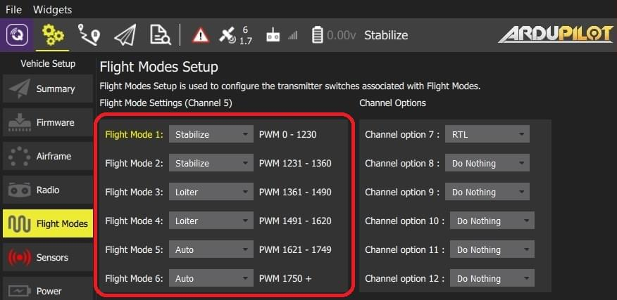

# ArduPilot 飞行模式设置

_飞行模式_ 部分允许您配置由遥控发射器上特定 开关 / 扳机位置 触发的飞行模式及其他操作。

::: info
In order to set up flight modes you must already have

> - [配置您的无线电](../setup_view/radio.md)以设置飞行模式。
> - [设置遥控发射机](../setup_view/FlightModes.md#transmitter-setup) (飞行模式 > 发射器设置)> ::

若要访问本部分，请在顶部工具栏中选择**齿轮** 图标(载具设置)，然后在侧边栏中选择**飞行模式**。

## 飞行模式设置

在 ArduPilot 中，你可以将多达 6 种不同的飞行模式分配到发射器的单个通道上（在固定翼飞行器（Plane）中该通道可选择，而在多旋翼飞行器（Copter）中则固定为通道 5 ）。
ArduCopter还允许您为第 7-12 频道指定额外的 _频道选项_。
这些允许您将函数分配给这些开关（例如，开启相机或返回启动）。

设置飞行模式：

1. 打开您的遥控器发射器。

2. 在顶部工具栏中选择**齿轮** 图标(载具设置)，然后在侧边栏中选择**飞行模式**。

   

   ::: info
   以上图像是ArduCopter飞行模式设置的屏幕截图。
   :::

3. 在降落中最多选择6种飞行模式。

4. **仅ArduCopter:** 为频道 7-12 选择额外的 _频道选项_。

5. **ArduPlane 仅限：** 从下拉列表中选择模式频道。

   

6. 通过在您的发射机上选择每个模式开关来测试模式是否映射到右转发器切换器。 并检查所需飞行模式是否已激活（在 _QGroundControl_ 上，激活的模式文本会变成黄色）。

所有值都在被更改时自动保存。

:::info
上面的ArduCopter屏幕截图显示了一个三位置飞行模式开关的典型设置，另外一个选项是RTL在通道7开关上。
你还可以利用发射机上的两个开关以及混合设置来设定6种飞行模式。 向下滚动到这个[页面](http://ardupilot.org/copter/docs/common-rc-transmitter-flight-mode-configuration.html#common-rc-transmitter-flight-mode-configuration)的中间部分，获取有关如何操作的教程。
:::

## 另请参考

- [ArduCopter 飞行模式](http://ardupilot.org/copter/docs/flight-modes.html)
- [ArduPlane 飞行模式](http://ardupilot.org/plane/docs/flight-modes.html)
- [ArduCopter > 辅助功能切换](https://ardupilot.org/copter/docs/channel-7-and-8-options.html#channel-7-and-8-options) - 关于频道配置的额外信息。
