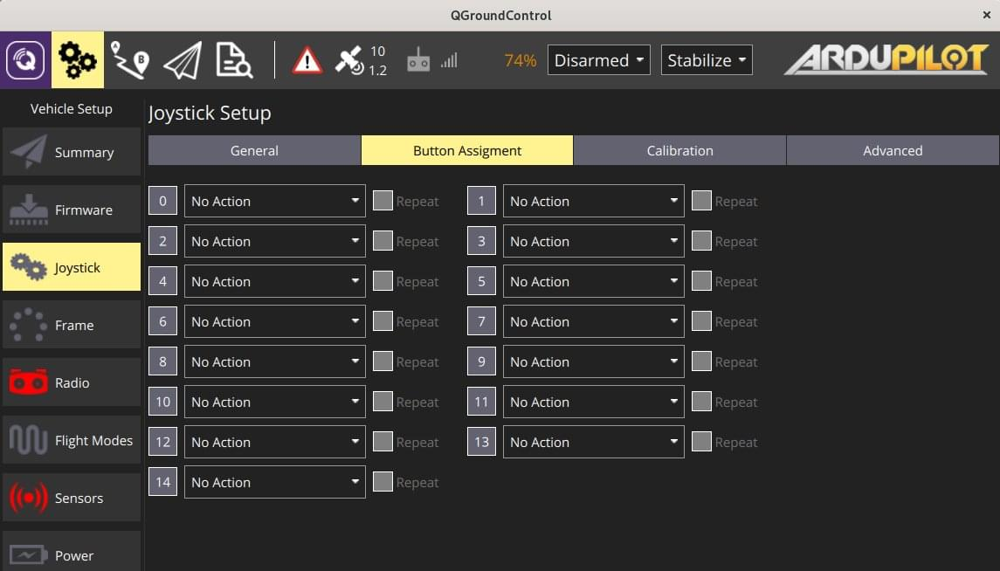
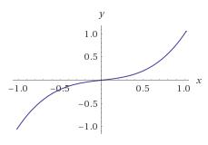

# Joystick Setup

_QGroundControl_ allows you to control a vehicle using a joystick or gamepad instead of an RC Transmitter.

:::info
Flying with a Joystick (or [virtual thumb-sticks](../settings_view/virtual_joystick.md)) requires a reliable high bandwidth telemetry channel to ensure that the vehicle is responsive to joystick movements (because joystick information is sent over MAVLink).
:::

:::info
Joystick and Gamepad support is enabled using the cross-platform [SDL2](http://www.libsdl.org/index.php) library.
Compatibility with a particular controller depends on SDL (all buttons that are exposed by that API are displayed through the _QGroundControl_ UI).
A [number of common joysticks and gamepads](#supported-joysticks) are known to work.
:::

:::info
The joystick is _enabled_ as the last step of the calibration process.
:::

## Enabling PX4 Joystick Support

To enable Joystick support in PX4 you need to set the parameter [`COM_RC_IN_MODE`](h[ttp://localhost:8080/px4_user_guide/en](https://docs.px4.io/en/main/advanced_config/parameter_reference.html#COM_RC_IN_MODE) to `1` - _Joystick_.
If this parameter is `0` then _Joystick_ will not be offered as a setup option.

This is enabled by default for PX4 SITL builds (see the [Parameters](../setup_view/parameters.md) topic for information on how to find and set a particular parameter).

## Ardupilot Joystick Support

All ArduPilot vehicles are supported. No parameter configuration is necessary.

## Configuring the Joystick {#configure}

To configure a joystick:

1. Start _QGroundControl_ and connect to a vehicle.

2. Connect the Joystick or Gamepad to a USB port.

3. Select the **Gear** icon (Vehicle Setup) in the top toolbar and then **Joystick** in the sidebar.
   The screen below will appear.

   

4. Make sure your joystick is selected in the **Active joystick** dropdown.

5. Go to the **Calibrate** Tab, press the **Start** button and then follow the on-screen instructions to calibrate/move the sticks.

   

   The joystick is _enabled_ as the last step of the calibration process.

6. Test the buttons and sticks work as intended by pressing them, and viewing the result in the Axis/Button monitor in the **General** tab.

7. Select the flight modes/vehicle functions activated by each joystick button.
   

## Advanced Options

Some additional Options are available at the **Advanced** tab.
These options may be useful for specific, unsual setups, for increasing sensibility, and for handling noisy joysticks.

### Throttle Options


- **Center stick is zero throttle**: Centered or lowered stick sends 0 in [MANUAL_CONTROL **z**](https://mavlink.io/en/messages/common.html#MANUAL_CONTROL), raised stick sends 1000.
  - **Spring loaded throttle smoothing**: In this mode you control not the throttle itself, but the rate at which it increases/decreases.
    This is useful for setups where the throttle stick is spring loaded, as the user can hold the desired throttle while releasing the stick.
- **Full down stick is zero throttle**: In this mode, lowered stick sends 0 in [MANUAL_CONTROL **z**](https://mavlink.io/en/messages/common.html#MANUAL_CONTROL), centered stick 500, and raised 1000.
- **Allow negative thrust**: When in **Center stick is zero throttle** mode, this allows the user to send negative values by lowering the stick.
  So that lowered stick sends -1000 in [MANUAL_CONTROL **z**](https://mavlink.io/en/messages/common.html#MANUAL_CONTROL), centered sends zero, and raised stick sends 1000.
  This mode is only enabled for vehicles that support negative thrust, such as [Rover](http://ardupilot.org/rover/index.html).

### Expo

The expo slider allows you to make the sticks less sensitive in the center, allowing finer control in this zone.


The slider adjusts the curvature of the exponential curve.



The higher the Expo value, the flatter the curve is at the center, and steeper it is at the edges.

### Advanced Settings

The advanced settings are not recommended for everyday users.
They can cause unpredicted results if used incorrectly.


The following settings are available:

- **Enable Gimbal Control**: Enabled two additional channels for controlling a gimbal.

- **Joystick Mode**: Changes what the joystick actually controls, and the MAVLink messages sent to the vehicle.

  - **Normal**: User controls as if using a regular RC radio, MAVLink [MANUAL_CONTROL](https://mavlink.io/en/messages/common.html#MANUAL_CONTROL) messages are used.
  - **Attitude**: User controls the vehicle attitude, MAVLink [SET_ATTITUDE_TARGET](https://mavlink.io/en/messages/common.html#SET_ATTITUDE_TARGET) messages are used.
  - **Position**: User controls the vehicle position, MAVLink [SET_POSITION_TARGET_LOCAL_NED](https://mavlink.io/en/messages/common.html#SET_POSITION_TARGET_LOCAL_NED) messages with bitmask for **position** only are used.
  - **Force**: User controls the forces applied to the vehicle, MAVLink [SET_POSITION_TARGET_LOCAL_NED](https://mavlink.io/en/messages/common.html#SET_POSITION_TARGET_LOCAL_NED) messages with bitmask for **force** only are used.
  - **Velocity**: User controls the forces applied to the vehicle, MAVLink [SET_POSITION_TARGET_LOCAL_NED](https://mavlink.io/en/messages/common.html#SET_POSITION_TARGET_LOCAL_NED) messages with bitmask for **velocity** only are used.

- **Axis Frequency**: When the joystick is idle (inputs are not changing), the joystick commands are sent to the vehicle at 5Hz. When the joystick is in use (input values are changing), the joystick commands are sent to the vehicle at the (higher) frequency configured by this setting. The default is 25Hz.

- **Button Frequency**: Controls the frequency at which repeated button actions are sent.

- **Enable Circle Correction**: RC controllers sticks describe a square, while joysticks usually describe a circle.
  When this option is enabled a square is inscribed inside the joystick movement area to make it more like an RC controller (so it is possible to reach all four corners). The cost is decreased resolution, as the effective stick travel is reduced.

  - **Disabled:** When this is **disabled** the joystick position is sent to the vehicle unchanged (the way that it is read from the joystick device).
    On some joysticks, the (roll, pitch) values are confined to the space of a circle inscribed inside of a square.
    In this figure, point B would command full pitch forward and full roll right, but the joystick is not able to reach point B because the retainer is circular.
    This means that you will not be able to achieve full roll and pitch deflection simultaneously.

    

  - **Enabled:** The joystick values are adjusted in software to ensure full range of commands.
    The usable area of travel and resolution is decreased, however, because the area highlighted grey in the figure is no longer used.

    

- **Deadbands:** Deadbands allow input changes to be ignored when the sticks are near their neutral positions.
  This helps to avoid noise or small oscillations on sensitive sticks which may be interpreted as commands, or small offsets when sticks do not re-center well.
  They can be adjusted during the first step of the [calibration](#configure), or by dragging vertically on the corresponding axis monitor.

## Supported Joysticks

The following joysticks/controllers have been shown to work with relatively recent _QGroundControl_ builds.

### Sony Playstation 3/4 Controllers

Both these joysticks are highly recommended.
They work well "out of the box" and have many buttons that you can map to flight modes.

#### Sony PS4 - DualShock 4 Controller V2 (Wireless setup)

This controller supports both USB and Bluetooth wireless connection.
Wired USB connection usually works out of the box.
The wireless connection needs some setup.

##### Linux Ubuntu setup

To make the controller work wirelessly under Linux the [jstest-gtk](https://jstest-gtk.gitlab.io/) and [ds4drv](https://github.com/chrippa/ds4drv) utilities are needed.

The steps are:

1. Install _jstest-gtk_:
   ```
   Install _jstest-gtk_: `sudo apt install jstest-gtk`
   ```
2. Install _ds4drv_:
   ```
   Install _ds4drv_: `sudo pip install ds4drv`
   ```
3. Run ds4drv `sudo ds4drv`
   ```
   sudo ds4drv
   ```
4. Hold **Share** button and then **PS** button until controller LED starts blinking rapidly.
   The _ds4drv_ should then detect a new device.
5. Last of all, you should check the controller setup by running the _jstest-gtk_ utility.

### FrSky Taranis XD9 plus

The _FrSky Taranis XD9 plus_ remote control can also be connected as a joystick.
You will need to connect it via the USB port on the back.

The Taranis does not allow you to use button options (to be precise, you can set the options, but toggling the buttons on your transmitter does not cause them to be pressed).

:::info
The Taranis is an open system that is openly being worked on.
It is possible that at time of writing there is a firmware or configuration that allows it to work effectively as a joystick.
:::

### Logitech Gamepad F310

The Logitech Gamepad F310 has been tested via USB on MacOSX "Sierra".

### Logitech Extreme 3D Pro

The [Logitech Extreme 3D Pro](http://gaming.logitech.com/en-ch/product/extreme-3d-pro-joystick) Joystick has been tested on all platforms (Linux, Windows, Mac OSX).
This is a single stick controller that can also be twisted. The main stick axes are used for pitch and roll, while the twist action is used for yaw. The throttle is mapped onto a separate wheel.

### Logitech F710 Gamepad

<!-- This is from http://qgroundcontrol.org/users/joystick -->

This gamepad is great for flying a multirotor manually via QGroundControl. It works on Windows, Linux and Mac OS.

#### Mac OS Leopard / Lion Setup

The F710 is detected under Leopard / Lion but is not automatically configured as an input device.
In order to get a working configuration, the F710 has to be recognised as _Rumblepad2_.

First check how it is recognised: **Apple > About this Mac > Additional Information > System Report > USB**.
It is detected as "Logitech Cordless RumblePad 2" then nothing further needs to be done.

If it is detected as a "Logitech Wireless 710", perform these steps:

1. Unplug the USB receiver of the gamepad
2. Prepare to quickly plug it into a USB port
3. Hit the Logitech button (its silver with the Logitech Logo on it in the center of the pad)
4. Quickly connect the USB receiver to your Mac
5. The pad should now be detected in the system report as "Logitech Cordless RumblePad 2". If not, retry the above steps.
