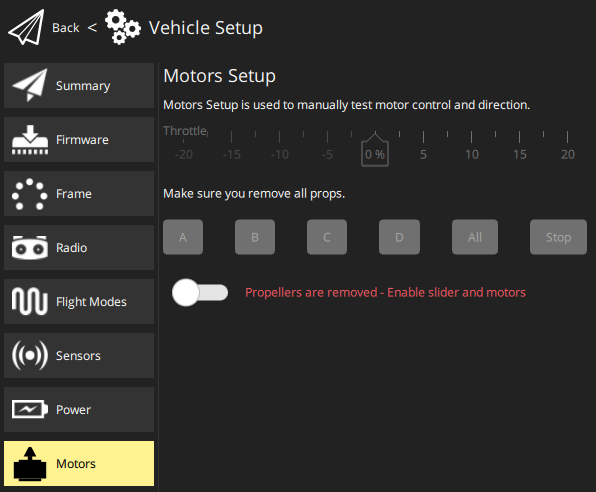

# Motor Setup

Motor Setup is used to test individual motors/servos (for example, to verify that motors spin in the correct direction).

:::tip
These instructions apply to PX4 and to most vehicle types on ArduPilot.
Vehicle-specific instructions are provided as sub-topics (e.g. [Motors Setup (ArduSub)](../setup_view/motors_ardusub.md)).
:::

## Test Steps

To test the motors:

1. Remove all propellers.

   ::: warning
   You must remove props before activating the motors!
   :::

2. (_PX4-only_) Enable safety switch - if used.

3. Slide the switch to enable motor slider and buttons (labeled: _Propellers are removed - Enable slider and motors_).

4. Adjust the slider to select the power for the motors.

5. Press the button corresponding to the motor and confirm it spin in the correct direction.

   ::: info
   The motors will automatically stop spinning after 3 seconds.
   You can also stop the motor by pressing the 'Stop' button.
   If no motors turn, raise the “Throttle %” and try again.
   :::

## Additional Information

- [Basic Configuration > Motor Setup](http://docs.px4.io/master/en/config/motors.html) (_PX4 User Guide_) - This contains additional PX4-specific information.
- [ESCS and Motors](https://ardupilot.org/copter/docs/connect-escs-and-motors.html#motor-order-diagrams) - This is the Motor order diagrams for all frames
