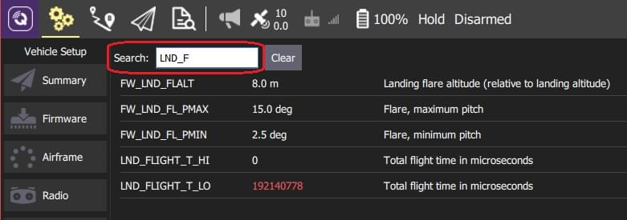

# 参数

_参数_ 屏幕（Screen）允许您找到并修改与载具相关的任何参数。

:::info
PX4 Pro 和 ArduPilot 使用不同的参数集，但它们都是按照本节描述的方式管理的。
:::

## 查找参数

参数按组编排。 点击左边的按钮来选择要查看的参数组(选中_电池校准组上方的图像)。

您也可以在 _搜索_ 字段中输入一个词来搜索参数。 这将向您显示包含输入子字符串的所有参数名称和描述列表(按 **清除** 重置搜索)。

## 更改参数

要更改参数的值，请单击组或搜索列表中的参数行。 单击后屏幕侧边会显示一个对话框，您在其中更改参数的值（这个对话框还提供了该参数的额外细节信息——包括是否需要重启才能使参数生效）。

:::info
当您点击 **保存** 时，参数会自动静默地上传到连接的载具。 对于不同的参数，你可能需要重启飞控才能使改变的参数生效。
:::

## 工具

您可以从屏幕右上侧的 **工具** 菜单中选择其他选项。

**刷新**  重新请求所有参数值以刷新。

**重置所有参数为默认值**  重置所有参数为原始默认值。

**从文件中载入/保存到文件**  从现有文件中载入参数或将当前参数设置保存到文件。

**清除遥控器（RC）与参数关联**   这将清除遥控器（RC）控制与参数之间的所有关联。 更多信息见：[无线电配置 > 参数调谐通道](../setup_view/radio.md#param-tuning-channels-px4)。

**重启载具**  重启载具(更改一些参数后需要)。
