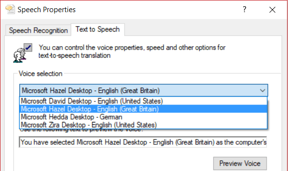
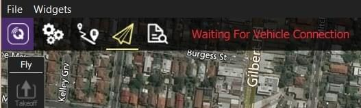
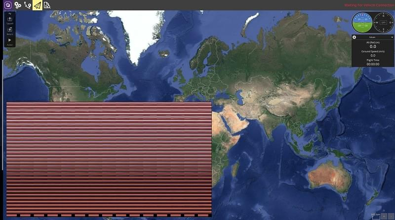

# Troubleshooting QGC Setup

This topic lists troubleshooting information related to _QGroundControl_ setup and installation on the host computer.

:::tip
Problems when **using** _QGroundControl_ to interact with a vehicle are covered in: [QGC Vehicle Interaction Problems](../troubleshooting/qgc_usage.md).
:::

## 64-bit Windows: Audio in Unexpected Language

On Windows 64-bit machines _QGroundControl_ may sometimes play audio/messages in a language that does not match the _Text-to-speech_ setting in **Control Panel > Speech** (e.g. audio spoken in German on an English machine).

This can occur because 64-bit Windows only displays 64-bit voices, while _QGroundControl_ is a 32-bit application (on Windows) and hence can only run 32-bit voices.

The solution is to set the desired _32-bit voice_ for your system:

1. Run the control panel application: **C:\Windows\SysWOW64\Speech\SpeechUX\sapi.cpl**.
2. Make your desired _Voice selection_ and then click **OK** at the bottom of the dialog.
   

:::info
Additional information about the Windows speech APIs can be found [here](https://www.webbie.org.uk/blog/microsoft-speech/).
:::

## Windows: UI Rendering/Video Driver Issues {#opengl_troubleshooting}

If you experience UI rendering issues or video driver crashes on Windows, this may be caused by "flaky" OpenGL drivers. _QGroundControl_ provides 3 shortcuts that you can use to start _QGroundControl_ in "safer" video modes (try these in order):

- **QGroundControl:** QGC uses OpenGL graphics drivers directly.
- **GPU Compatibility Mode:** QGC uses ANGLE drivers, which implement OpenGL on top of DirectX.
- **GPU Safe Mode:** QGC uses a software rasterizer for the UI (this is very slow).

## Windows: Doesn't connect to Vehicle over WiFi {#waiting_for_connection}

If _QGroundControl_ sits forever (for example, _Waiting For Vehicle Connection_) when trying to connect to the vehicle over Wifi, a possible cause is that IP traffic is being blocked by firewall software (e.g. Windows Defender, Norton, etc.).



The solution is to allow the _QGroundControl_ app through the firewall.

:::info
It is possible to simply switch the network profile from Public to Private to allow connections, but this exposes your PC to the Network, so be careful
:::

If using _Windows Defender_:

- In the **Start** bar, enter/select: _Firewall & Network Protection_ (System Settings).
- Scroll to and select the option: _Allow an app through firewall_.
- Select _QGroundControl_ and change the _Access_ selector to **Allow**.

  ::: tip
  Programs are listed in alphabetical order by description (not filename).
  You'll find QGC under **O**: _Open source ground control app provided by QGroundControl dev team_
  :::

## Ubuntu: Video Streaming Fails (Missing Gstreamer) {#missing_gstreamer}

On Ubuntu you must install _Gstreamer_ components in order to see video streams.
If these are not installed _QGroundControl_ is unable to create the gstreamer nodes and fails with:

```sh
VideoReceiver::start() failed. Error with gst_element_factory_make(‘avdec_h264’)
```

The [download/install instructions for Ubuntu](../getting_started/download_and_install.md#ubuntu) include _GStreamer_ setup information.

## Ubuntu 18.04: Video Streaming Fails on Dual Video Adapter Systems {#dual_vga}



The version of GSteamer in Ubuntu 18.04 has a bug that prevents video displaying when using a VA API based decoder (i.e. vaapih264dec etc.) on systems that have both Intel and NVidia video display adapters.

:::info
More generally, while the problem is known to occur on Ubuntu 18.04 with Intel and NVidia VGAs, it might occur on any linux system and other types of (dual) VGAs.
:::

The easiest way to get _QGroundControl_ to work in this case is to start it using the following command line:

```
LIBVA_DRIVER_NAME=fakedriver ./QGroundControl)  will this make the
```

Other alternatives are to disable one of the VGAs, uninstall VA API components, or upgrade to GStreamer 1.16 (there is no easy way to do this on Ubuntu 18.04 - please contribute a recipe if you find one!)

## Ubuntu 16.04: GLIBC_2.27 not found {#glibc_2_27}

The pre-built AppImages for QGroundControl 4.0 (and later) can only run on Ubuntu 18.04 LTS (or later).
They do not run on Ubuntu 16.04.

If you try you will get the error as shown:

```sh
$ ./QGroundControl.AppImage
/tmp/.mount_i4hPuB/QGroundControl: /lib/x86_64-linux-gnu/libm.so.6: version `GLIBC_2.27' not found (required by /tmp/.mount_i4hPuB/QGroundControl)
```

If you need to use Ubuntu 16.04 then one workaround is to build from source without the video libraries.
