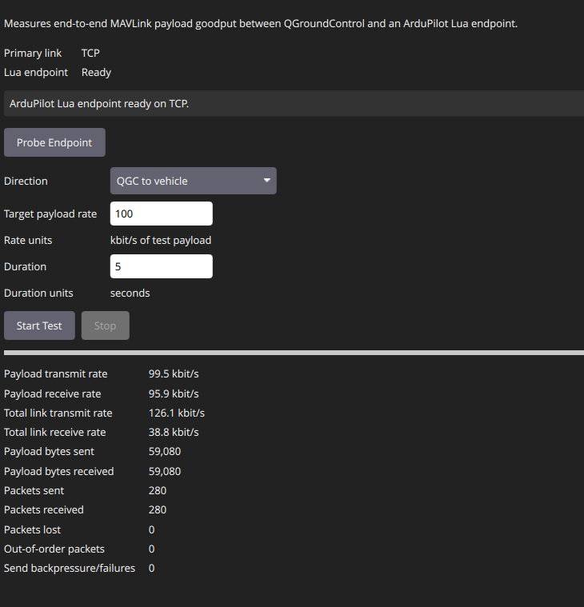
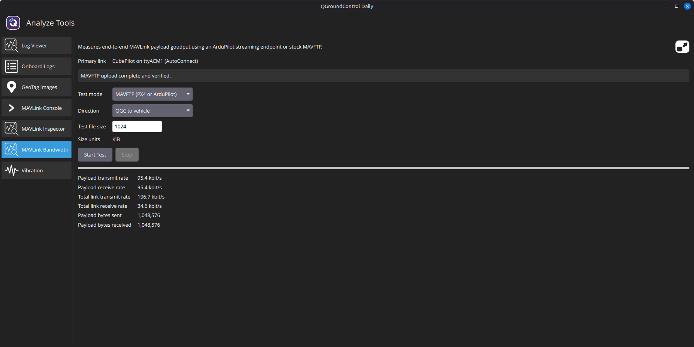

# MAVLink bandwidth test

QGroundControl's **Analyze > MAVLink Bandwidth** tool has two test modes:

- **MAVFTP** works with stock PX4 and ArduPilot. QGC generates a temporary file, times the selected transfer
  direction, verifies the data using SHA-256, and removes the remote file.
- **Streaming** uses the included ArduPilot Lua endpoint for controlled packet-rate and loss measurements. It uses
  the standard MAVLink `TUNNEL` message with a magic/versioned inner protocol.

Streaming mode:

MAVFTP mode:

## MAVFTP mode

MAVFTP mode requires no vehicle-side installation. Select the file size and transfer direction, then start the test.
Preparatory and verification transfers are excluded from measured goodput and selected-link byte counts.

PX4 test files use `/fs/microsd`; ArduPilot test files use `/APM`. Tests are disarmed-only, and remote files are
named with a random token to avoid replacing existing data.

## ArduPilot streaming mode

1. Enable ArduPilot scripting for a supported board.
2. Upload `APM/scripts/mavlink_bandwidth.lua` to the vehicle's `APM/scripts` directory.
3. Restart scripting or reboot the vehicle while disarmed.
4. Open **Analyze > MAVLink Bandwidth** and select **Probe Endpoint**.

Streaming tests are capped at 2 Mbit/s of test payload for at most 60 seconds.

## Measurement boundary

The result is end-to-end available MAVLink bandwidth, not raw RF bitrate. MAVFTP results include reliable-transfer
protocol and storage overhead. Streaming results include QGC, the selected link, ArduPilot MAVLink queues, and the
Lua scheduler. QGC reports test-payload goodput separately from all bytes observed on the selected link.

ArduPilot's scripting MAVLink receive queue and message registrations are process-global. Scripts that also call
`mavlink:init()` can replace this endpoint's registrations; consolidate MAVLink registration when combining this
endpoint with other MAVLink-consuming scripts.

For SITL, add `sitl.params` to the normal vehicle defaults and place the Lua file in the runtime directory's `scripts`
subdirectory.
